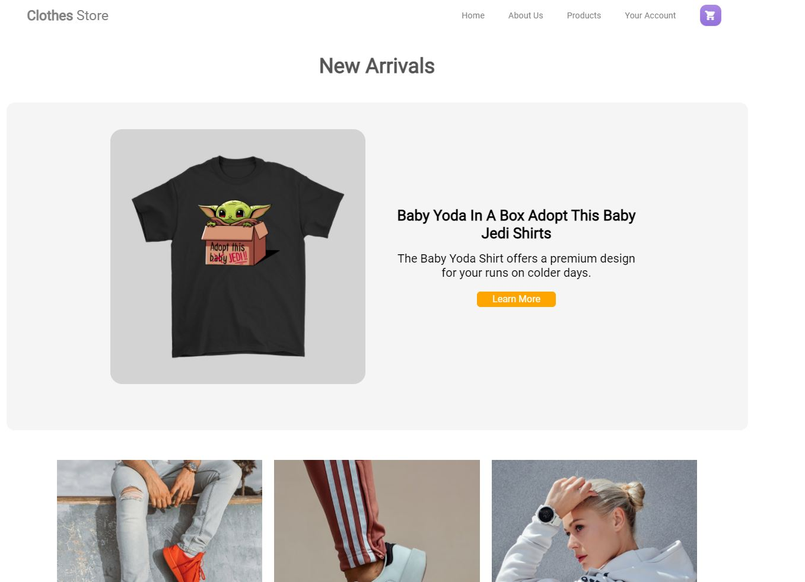
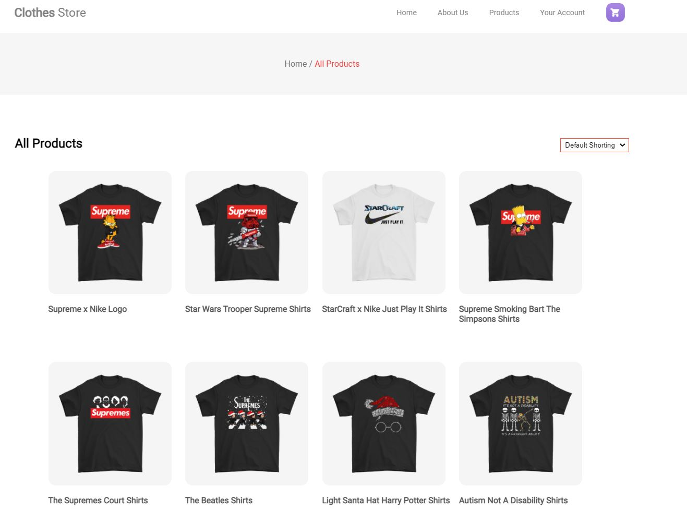

## Clothes Store

Clothes Store is a web application built with Html, css, JavaScript and Nodejs that allows customers to view productes like an online clothe shop and also to add products in thier carts, this web application is also mobile friendly.

# Important!

Do not use this software for commercial purposes

If you're using this software to directly, or indirectly, make money; then you're using the software for a commercial purpose, and the creator wants a licensing fee to get paid for the coding work in producing the software.

# Images
Images we are seeing on this web page are downloaded from `https://thedailyshirts.com/products/baby-yoda-in-a-box-adopt-this-baby-jedi-shirts/`

### Install node dependencies

```
npm install
```

### Start server

```
npm start
```


## Captures

Templates



Templates



